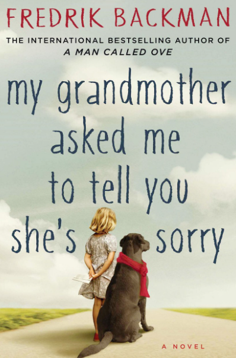

# My Grandmother Asked Me to Tell You She's Sorry by Fredrick Backman

<u> Rating: 4/5 </u>

**Synopsis**

Elsa is seven years old and different. Her grandmother is seventy-seven years old and crazy—as in standing-on-the-balcony-firing-paintball-guns-at-strangers crazy. She is also Elsa’s best, and only, friend. At night Elsa takes refuge in her grandmother’s stories, in the Land-of-Almost-Awake and the Kingdom of Miamas, where everybody is different and nobody needs to be normal.

When Elsa’s grandmother dies and leaves behind a series of letters apologizing to people she has wronged, Elsa’s greatest adventure begins. Her grandmother’s instructions lead her to an apartment building full of drunks, monsters, attack dogs, and old crones but also to the truth about fairy tales and kingdoms and a grandmother like no other.

**Genres**

Fiction, Contemporary, Humor, Adult, Fantasy