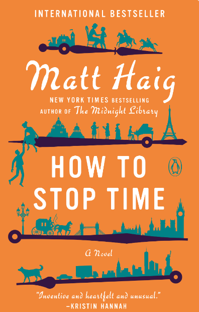

# How to Stop Time by Matt Haig

<u> Rating: 3/5 <u>

**Synopsis**

Tom Hazard has just moved back to London, his old home, to settle down and become a high school history teacher. And on his first day at school, he meets a captivating French teacher at his school who seems fascinated by him. But Tom has a dangerous secret. He may look like an ordinary 41-year-old, but owing to a rare condition, he's been alive for centuries. Tom has lived history--performing with Shakespeare, exploring the high seas with Captain Cook, and sharing cocktails with Fitzgerald. Now, he just wants an ordinary life.

Unfortunately for Tom, the Albatross Society, the secretive group which protects people like Tom, has one rule: Never fall in love. As painful memories of his past and the erratic behavior of the Society's watchful leader threaten to derail his new life and romance, the one thing he can't have just happens to be the one thing that might save him. Tom will have to decide once and for all whether to remain stuck in the past, or finally begin living in the present.

**Genres**

*Fiction, Fantasy, Historical Fiction, Science Fiction, Time Travel, Romance*